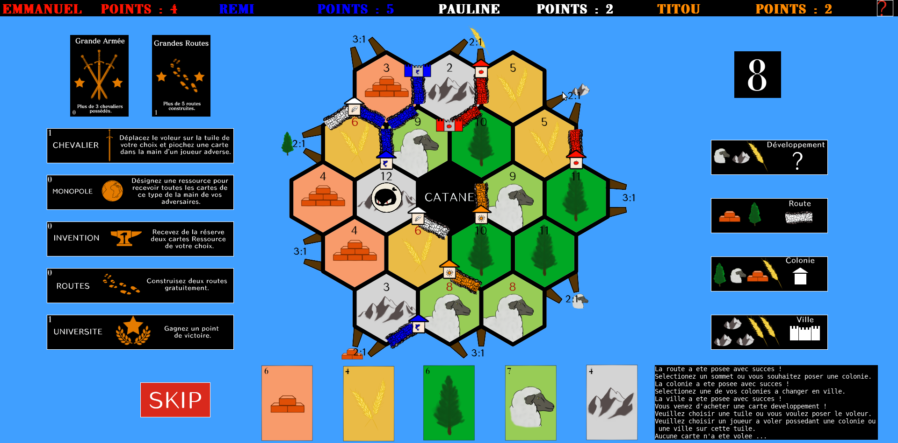

# Catane

Ce projet consiste en l'adaptation vidéoludique du jeu de plateau Les Colons de Catane. Chaque joueur joue à tour de rôle sur une même machine.



## Getting Started

These instructions will get you a copy of the project up and running on your local machine for development and testing purposes.

### Prerequisites

What things you need to install the software and how to install them

##### Bibliothèque CMocka

* Linux - Entrer dans un terminal la commande : 
```
sudo apt-get install libcmocka-dev
```

* Windows - Télécharger l'archive zip cmocka-1.1.0-mingw.zip, à l'adresse https://cmocka.org/files/1.1/, puis suivre les instructions d'installation.

##### Bibliothèque SDL2

* Linux - Entrer dans un terminal la commande : 
```
sudo apt-get install libsdl2-dev
```

* Windows - Télécharger l'archive zip adéquate, catégorie Development Libraries, à l'adresse https://www.libsdl.org/download-2.0.php, puis suivre les instructions d'installation.

##### Bibliothèque SDL2-ttf

* Linux - Entrer dans un terminal la commande : 
```
sudo apt-get install libsdl2-ttf-dev
```

* Windows - Télécharger l'archive zip adéquate, catégorie Development Libraries, à l'adresse https://www.libsdl.org/projects/SDL_ttf/, puis suivre les instructions d'installation.

##### Système de compilation CMake

* Linux - Entrer dans un terminal la commande : 
```
sudo apt-get install cmake
```

* Windows - Télécharger l'archive zip adéquate, à l'adresse https://cmake.org/download/, puis suivre les instructions d'installation.

### Installing

A step by step series of examples that tell you how to get a development env running

Dans le dossier catane, générer le fichier Makefile 

```
cmake .
```

Puis construire les binaires

```
make all
```

## Running the tests

Pour lancer les tests du modèle, se rendre dans le dossier bin, puis lancer l'exécutable catane_tests.

## Built With

* [Code::Blocks](http://www.codeblocks.org/) - The IDE used
* [CMake](https://cmake.org/) - Compilation system

## Authors

* **Emmanuel Durel** 
* **Rémi Fargeon**
* **Titouan Gaborit**
* **Pauline Manauthon**

## Acknowledgments

* Hat tip to anyone whose code was used
* Inspiration
* etc